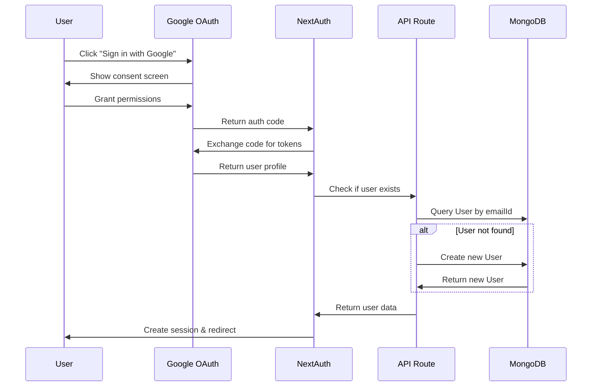

## Overview

TeamUp uses **NextAuth.js v5** (beta) with Google OAuth for authentication. This provides a secure, session-based authentication system with minimal configuration.

<Note>
  NextAuth v5 introduces a simplified API with better TypeScript support and Edge runtime compatibility.
</Note>

## NextAuth.js Configuration

The main authentication configuration is in `auth.ts` at the root of the project:

```typescript
import NextAuth from "next-auth"
import Google from "next-auth/providers/google"

export const { handlers, auth, signIn, signOut } = NextAuth({
  providers: [Google],
})
```

### Exported Functions

<ParamField path="handlers" type="{ GET, POST }">
  HTTP handlers for the NextAuth.js API routes. Used in `/api/auth/[...nextauth]/route.ts`.
</ParamField>

<ParamField path="auth" type="function">
  Helper function to get the current session. Can be used in Server Components, API routes, and middleware.
</ParamField>

<ParamField path="signIn" type="function">
  Function to initiate the sign-in flow programmatically.
</ParamField>

<ParamField path="signOut" type="function">
  Function to sign out the current user.
</ParamField>

## Google OAuth Provider

### Configuration

The Google provider is configured to use environment variables:

```typescript
import Google from "next-auth/providers/google"

export const { handlers, auth, signIn, signOut } = NextAuth({
  providers: [Google],
})
```

NextAuth automatically reads these environment variables:
- `AUTH_GOOGLE_ID` - Google OAuth Client ID
- `AUTH_GOOGLE_SECRET` - Google OAuth Client Secret

### Setting Up Google OAuth

<Steps>
  <Step title="Create Google Cloud Project">
    1. Go to [Google Cloud Console](https://console.cloud.google.com/)
    2. Create a new project or select an existing one
    3. Navigate to **APIs & Services** > **Credentials**
  </Step>
  
  <Step title="Configure OAuth Consent Screen">
    1. Click **OAuth consent screen** in the sidebar
    2. Select **External** user type
    3. Fill in application name, user support email, and developer contact
    4. Add scopes: `userinfo.email`, `userinfo.profile`
    5. Add test users if app is not published
  </Step>
  
  <Step title="Create OAuth 2.0 Credentials">
    1. Click **Create Credentials** > **OAuth client ID**
    2. Select **Web application**
    3. Add authorized redirect URIs:
       - Development: `http://localhost:3000/api/auth/callback/google`
       - Production: `https://yourdomain.com/api/auth/callback/google`
    4. Copy the Client ID and Client Secret
  </Step>
  
  <Step title="Add Credentials to Environment">
    Add to `.env.local`:
    ```bash
    AUTH_GOOGLE_ID=your-client-id.apps.googleusercontent.com
    AUTH_GOOGLE_SECRET=your-client-secret
    ```
  </Step>
</Steps>

<Warning>
  Keep your `AUTH_GOOGLE_SECRET` secure and never commit it to version control.
</Warning>

## API Route Configuration

The NextAuth.js API handlers are mounted at `/api/auth/[...nextauth]/route.ts`:

```typescript
import { handlers } from "../../../../../auth";
export const { GET, POST } = handlers
```

This creates the following endpoints:

| Endpoint | Description |
|----------|-------------|
| `GET /api/auth/signin` | Sign in page |
| `GET /api/auth/signout` | Sign out page |
| `GET /api/auth/callback/:provider` | OAuth callback handler |
| `GET /api/auth/session` | Get current session |
| `POST /api/auth/signin/:provider` | Initiate provider sign-in |
| `POST /api/auth/signout` | Sign out current session |

## Session Management

### Getting Session in Server Components

Use the `auth()` function in Server Components:

```typescript
import { auth } from '@/auth';

export default async function HomePage() {
  const session = await auth();
  
  if (!session?.user) {
    return <div>Please sign in</div>;
  }
  
  return <div>Welcome, {session.user.name}!</div>;
}
```

### Getting Session in API Routes

Use `auth()` in Next.js API routes:

```typescript
import { auth } from '@/auth';
import { NextRequest, NextResponse } from 'next/server';

export async function GET(request: NextRequest) {
  const session = await auth();
  
  if (!session?.user) {
    return NextResponse.json(
      { error: 'Unauthorized' },
      { status: 401 }
    );
  }
  
  // User is authenticated
  return NextResponse.json({ user: session.user });
}
```

### Session Object Structure

```typescript
{
  user: {
    name: string,      // From Google profile
    email: string,     // From Google profile
    image: string      // Profile picture URL
  },
  expires: string      // ISO 8601 date string
}
```

## Protected Routes with Middleware

TeamUp uses Next.js middleware to protect routes and enforce authentication.

### Middleware Implementation

From `src/middleware.ts`:

```typescript
import { NextResponse } from 'next/server'
import type { NextRequest } from 'next/server'
import { auth } from '../auth'

export default async function middleware(req: NextRequest) {
    const session = await auth();
    const { pathname } = req.nextUrl;

    // Protect API routes and /home, except OAuth callback
    if (!session?.user && 
        (pathname.startsWith('/api') || pathname.startsWith('/home')) && 
        !pathname.startsWith('/api/auth/callback')) {
        const url = req.nextUrl.clone();
        url.pathname = '/log-in';
        return NextResponse.redirect(url);
    }

    // Redirect authenticated users from login page
    if (session?.user && pathname.startsWith('/log-in')) {
        const url = req.nextUrl.clone();
        url.pathname = '/home';
        return NextResponse.redirect(url);
    }

    // Redirect root to login
    if (pathname == '/') {
        const url = req.nextUrl.clone();
        url.pathname = '/log-in';
        return NextResponse.redirect(url);
    }

    return NextResponse.next();
}
```

### Middleware Logic

<Steps>
  <Step title="Check Session">
    Get the current session using `auth()` function.
  </Step>
  
  <Step title="Protect API Routes">
    If no session exists and user tries to access `/api/*` or `/home/*` (except OAuth callback), redirect to `/log-in`.
  </Step>
  
  <Step title="Handle Login Page">
    If user is already authenticated and visits `/log-in`, redirect to `/home`.
  </Step>
  
  <Step title="Handle Root Path">
    Redirect root path `/` to `/log-in`.
  </Step>
</Steps>

<Note>
  The middleware runs on **every request** before it reaches your pages or API routes. It's executed at the Edge runtime for optimal performance.
</Note>

## User Creation Flow

When a user signs in with Google for the first time, TeamUp creates a user record in MongoDB.

### Sign-Up Endpoint

From `src/app/api/sign-up/route.ts`:

```typescript
import { NextRequest, NextResponse } from 'next/server';
import { User } from '../../../../models/userModel';
import mongoose from 'mongoose';

export const dynamic = 'force-dynamic'
export const maxDuration = 60 // Extend timeout to 60 seconds

export async function POST(request: NextRequest) {
    try {
        if (mongoose.connection.readyState !== 1) {
            await mongoose.connect(process.env.MONGODB_URI+'', {
                serverSelectionTimeoutMS: 15000,
                socketTimeoutMS: 45000,
                connectTimeoutMS: 15000,
            });
        }
        
        const body = await request.json();
        const userData = {
            firstName: body.firstName || null,
            lastName: body.lastName || null,
            username: body.username || null,
            password: body.password || null,
            emailId: body.emailId || null,
            projects: body.projects || null,
            tasks: body.tasks || null,
            contributions: body.contributions || null,
        };

        const newUser = new User(userData);
        await newUser.save();

        return NextResponse.json(
            { message: 'User created successfully!', user: newUser },
            { status: 201 }
        );
    } catch (error) {
        console.error('Error during user creation:', error);
        return NextResponse.json(
            { message: 'Error creating users' },
            { status: 500 }
        );
    }
}
```

### User Creation Process



<Accordion title="Why no automatic user creation?">
  NextAuth v5 doesn't automatically create database records. You need to implement user creation in your application logic, typically:
  
  1. **During first sign-in**: Check if user exists, create if not
  2. **Using callbacks**: Implement the `signIn` callback to create users
  3. **Client-side check**: After OAuth, check if user exists in DB
  
  TeamUp uses approach #3 with the `/api/sign-up` endpoint.
</Accordion>

## Authentication in API Routes

### Pattern: Check Session First

Most API routes follow this pattern:

```typescript
import { auth } from '@/auth';
import { NextRequest, NextResponse } from 'next/server';

export async function GET(request: NextRequest) {
  // 1. Check authentication
  const session = await auth();
  if (!session?.user) {
    return NextResponse.json(
      { error: 'Unauthorized' },
      { status: 401 }
    );
  }
  
  // 2. Get user email from session
  const userEmail = session.user.email;
  
  // 3. Proceed with authenticated logic
  const user = await User.findOne({ emailId: userEmail });
  // ...
}
```

### Example: Protected Project Creation

From `src/app/api/create-project/route.ts`:

```typescript
import { NextRequest, NextResponse } from 'next/server';
import { Project } from '../../../../models/projectModel';
import { User } from '../../../../models/userModel';
import mongoose from 'mongoose';

export async function POST(request: NextRequest) {
    try {
        // Connect to database
        if (mongoose.connection.readyState !== 1) {
            await mongoose.connect(process.env.MONGODB_URI+'', {
                serverSelectionTimeoutMS: 15000,
                socketTimeoutMS: 45000,
                connectTimeoutMS: 15000,
            });
        }
        
        const body = await request.json();
        const projectData = {
            title: body.title || null,
            description: body.description || null,
            owner: body.owner || null,
            maintainers: body.maintainers || null,
            contributors: body.contributors || null,
            tasks: body.tasks || null,
            contributions: body.contributions || null,
        };
        
        // Create project
        const newProject = new Project(projectData);
        const projectCreated = await newProject.save();
        
        // Update all contributors
        projectData.contributors.forEach(async(contributorEmailId: string) => {
            await User.findOneAndUpdate(
                { emailId: contributorEmailId },
                { $push: { projects: projectCreated._id } }
            );
        });
        
        return NextResponse.json(
            { message: 'Project created successfully!', project: newProject },
            { status: 201 }
        );
    } catch (error) {
        console.error('Error during project creation:', error);
        return NextResponse.json(
            { message: 'Error creating project' },
            { status: 500 }
        );
    }
}
```

<Note>
  The middleware already protects this route, so we don't need to check authentication again in the handler. The session check is done at the middleware level.
</Note>

## Client-Side Authentication

### Sign In Button

```typescript
import { signIn } from 'next-auth/react';

export function SignInButton() {
  return (
    <button onClick={() => signIn('google', { callbackUrl: '/home' })}>
      Sign in with Google
    </button>
  );
}
```

### Sign Out Button

```typescript
import { signOut } from 'next-auth/react';

export function SignOutButton() {
  return (
    <button onClick={() => signOut({ callbackUrl: '/log-in' })}>
      Sign out
    </button>
  );
}
```

### Get Session in Client Components

```typescript
'use client';

import { useSession } from 'next-auth/react';

export function UserProfile() {
  const { data: session, status } = useSession();
  
  if (status === 'loading') {
    return <div>Loading...</div>;
  }
  
  if (status === 'unauthenticated') {
    return <div>Please sign in</div>;
  }
  
  return (
    <div>
      
      <p>{session.user.name}</p>
      <p>{session.user.email}</p>
    </div>
  );
}
```

## Security Best Practices

<CardGroup cols={2}>
  <Card title="Use HTTPS in Production" icon="lock">
    Always use HTTPS for production deployments. OAuth requires secure redirect URIs.
  </Card>
  
  <Card title="Set NEXTAUTH_SECRET" icon="key">
    Generate a strong random secret for production:
    ```bash
    openssl rand -base64 32
    ```
  </Card>
  
  <Card title="Validate Redirect URIs" icon="shield-check">
    Only whitelist specific redirect URIs in Google Cloud Console. Never use wildcards.
  </Card>
  
  <Card title="Check Session Server-Side" icon="server">
    Always validate authentication on the server, not just the client. Use middleware or session checks in API routes.
  </Card>
  
  <Card title="Rate Limit Auth Endpoints" icon="gauge">
    Implement rate limiting on authentication endpoints to prevent brute force attacks.
  </Card>
  
  <Card title="Monitor Failed Auth Attempts" icon="chart-line">
    Log and monitor failed authentication attempts for security analysis.
  </Card>
</CardGroup>

## Troubleshooting

<AccordionGroup>
  <Accordion title="Error: redirect_uri_mismatch">
    **Cause**: The redirect URI in your request doesn't match any authorized URIs in Google Cloud Console.
    
    **Solution**:
    1. Check your authorized redirect URIs in Google Cloud Console
    2. Ensure it matches exactly: `http://localhost:3000/api/auth/callback/google`
    3. No trailing slashes or extra parameters
    4. For production, add your production domain
  </Accordion>
  
  <Accordion title="Error: invalid_client">
    **Cause**: Invalid Client ID or Client Secret.
    
    **Solution**:
    1. Verify `AUTH_GOOGLE_ID` and `AUTH_GOOGLE_SECRET` in `.env.local`
    2. Regenerate credentials in Google Cloud Console if needed
    3. Restart development server after changing env vars
  </Accordion>
  
  <Accordion title="Session is null/undefined">
    **Cause**: Session not properly initialized or expired.
    
    **Solution**:
    1. Check if `NEXTAUTH_SECRET` is set in production
    2. Verify `NEXTAUTH_URL` matches your domain
    3. Clear browser cookies and try again
    4. Check browser console for errors
  </Accordion>
  
  <Accordion title="Middleware not protecting routes">
    **Cause**: Middleware configuration issue.
    
    **Solution**:
    1. Ensure `middleware.ts` is in `src/` directory (or root for Pages Router)
    2. Check that `auth()` function is properly imported
    3. Verify middleware is running (add console.log to test)
    4. Check Next.js version compatibility
  </Accordion>
</AccordionGroup>

## Next Steps

<CardGroup cols={2}>
  <Card title="Database Schema" icon="database" href="/developers/database-schema">
    See how user data is stored in MongoDB
  </Card>
  
  <Card title="API Overview" icon="code" href="/developers/api-overview">
    Learn about protected API endpoints
  </Card>
</CardGroup>