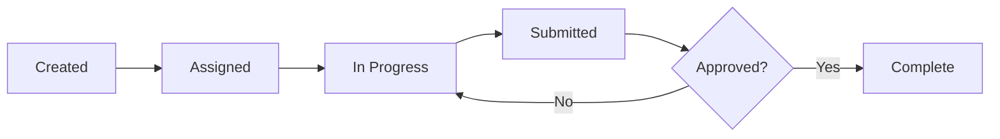
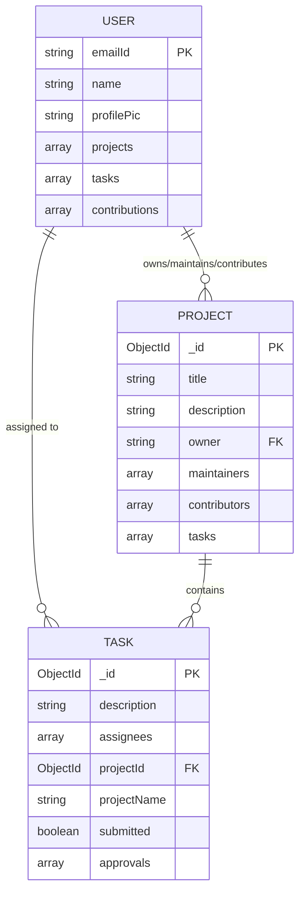

## Overview

TeamUp uses MongoDB with Mongoose ODM for data persistence. The application has three primary collections:

- **Users**: Team members and their profile information
- **Projects**: Collaborative projects with tasks and contributors
- **Tasks**: Individual work items assigned to users

<Note>
  All models use Mongoose schemas with automatic timestamp generation and optimized indexes for performance.
</Note>

## User Schema

The User model stores information about registered users and their associations with projects and tasks.

### Schema Definition

From `models/userModel.ts`:

```typescript
import mongoose from 'mongoose';

const userSchema = new mongoose.Schema({
  name: {
    type: String,
    required: [true, 'Please add name'],
  },
  emailId: {
    type: String,
    required: [true, 'Please add email id'],
    unique: true,
  },
  profilePic: {
    type: String,
  },
  projects: {
    type: Array,
    // Array of project ObjectIds
  },
  tasks: {
    type: Array,
    // Array of task ObjectIds
  },
  contributions: {
    type: Array,
    // Array of contribution records
  },
}, { timestamps: true });

// Indexes
userSchema.index({ emailId: 1 }, { unique: true });
userSchema.index({ tasks: 1 });
userSchema.index({ projects: 1 });

export const User = mongoose.models.User || mongoose.model('User', userSchema);
```

### Fields

<ParamField path="name" type="string" required>
  User's full name from OAuth provider (typically Google).
</ParamField>

<ParamField path="emailId" type="string" required>
  User's email address. Must be unique across all users. Used as the primary identifier for authentication and user lookups.
</ParamField>

<ParamField path="profilePic" type="string">
  URL to the user's profile picture, typically from Google OAuth.
</ParamField>

<ParamField path="projects" type="array">
  Array of MongoDB ObjectIds referencing projects the user is involved in (as owner, maintainer, or contributor).
</ParamField>

<ParamField path="tasks" type="array">
  Array of MongoDB ObjectIds referencing tasks assigned to the user.
</ParamField>

<ParamField path="contributions" type="array">
  Array storing user's contribution history and activity records.
</ParamField>

<ParamField path="createdAt" type="Date" default="Date.now()">
  Automatically generated timestamp when the user is created.
</ParamField>

<ParamField path="updatedAt" type="Date" default="Date.now()">
  Automatically updated timestamp when the user document is modified.
</ParamField>

### Indexes

The User schema has three indexes for optimal query performance:

```typescript
// Unique index on emailId for fast user lookups
userSchema.index({ emailId: 1 }, { unique: true });

// Index on tasks array for task-based queries
userSchema.index({ tasks: 1 });

// Index on projects array for project membership queries
userSchema.index({ projects: 1 });
```

<Accordion title="Why these indexes?">
  - **emailId**: Primary lookup field for authentication and user searches
  - **tasks**: Enables fast queries like "find all users with this task"
  - **projects**: Enables fast queries like "find all users in this project"
</Accordion>

## Project Schema

The Project model represents collaborative workspaces where teams manage tasks and contributions.

### Schema Definition

From `models/projectModel.ts`:

```typescript
import mongoose from 'mongoose';

const projectSchema = new mongoose.Schema({
  title: {
    type: String,
    required: [true, 'Please add title'],
  },
  description: {
    type: String,
  },
  owner: {
    type: String, // email of owner
    required: [true, 'Please add owner'],
  },
  maintainers: {
    type: Array, // array of emails of maintainers
    required: [true, 'Please add maintainers'],
  },
  contributors: {
    type: Array, // array of emails of contributors
    required: [true, 'Please add contributors'],
  },
  tasks: {
    type: Array,
  },
  contributions: {
    type: Array,
  },
}, { timestamps: true });

// Indexes
projectSchema.index({ owner: 1 });
projectSchema.index({ contributors: 1 });
projectSchema.index({ maintainers: 1 });
projectSchema.index({ title: 1 });
projectSchema.index({ 'tasks': 1 });
projectSchema.index({ owner: 1, title: 1 });
projectSchema.index({ 'tasks.status': 1 });
projectSchema.index({ createdAt: 1 });

export const Project = mongoose.models.Project || mongoose.model('Project', projectSchema);
```

### Fields

<ParamField path="title" type="string" required>
  Project name/title. Displayed throughout the application.
</ParamField>

<ParamField path="description" type="string">
  Detailed project description. Supports markdown formatting.
</ParamField>

<ParamField path="owner" type="string" required>
  Email address of the project owner. The owner has full control over the project.
</ParamField>

<ParamField path="maintainers" type="string[]" required>
  Array of email addresses of users with maintainer privileges. Maintainers can approve tasks and manage contributors.
</ParamField>

<ParamField path="contributors" type="string[]" required>
  Array of email addresses of all project contributors (includes owner and maintainers).
</ParamField>

<ParamField path="tasks" type="array">
  Array of task ObjectIds associated with this project.
</ParamField>

<ParamField path="contributions" type="array">
  Array of contribution records for the project.
</ParamField>

<ParamField path="createdAt" type="Date" default="Date.now()">
  Automatically generated timestamp when the project is created.
</ParamField>

<ParamField path="updatedAt" type="Date" default="Date.now()">
  Automatically updated timestamp when the project is modified.
</ParamField>

### Indexes

The Project schema has comprehensive indexes for various query patterns:

```typescript
projectSchema.index({ owner: 1 });              // Owner's projects
projectSchema.index({ contributors: 1 });       // Projects by contributor
projectSchema.index({ maintainers: 1 });        // Projects by maintainer
projectSchema.index({ title: 1 });              // Search by title
projectSchema.index({ 'tasks': 1 });            // Tasks within project
projectSchema.index({ owner: 1, title: 1 });    // Composite: owner + title
projectSchema.index({ 'tasks.status': 1 });     // Task status queries
projectSchema.index({ createdAt: 1 });          // Recently created projects
```

<Note>
  The project schema uses email addresses (strings) for relationships rather than ObjectIds. This design choice simplifies lookups when users sign in with OAuth.
</Note>

## Task Schema

The Task model represents individual work items within projects.

### Schema Definition

From `models/taskModel.ts`:

```typescript
import mongoose from 'mongoose';

const taskSchema = new mongoose.Schema({
  description: { 
    type: String, 
    required: true 
  },
  assignees: [{ 
    type: String 
  }],
  fileUrl: { 
    type: String 
  },
  projectName: { 
    type: String, 
    required: true 
  },
  projectId: { 
    type: mongoose.Schema.Types.ObjectId, 
    required: true 
  },
  createdAt: { 
    type: Date, 
    default: Date.now 
  },
  submitted: { 
    type: Boolean, 
    default: false 
  },
  approvals: [{ 
    type: String 
  }], // Array of maintainer emails who approved
});

export const Task = mongoose.models.Task || mongoose.model('Task', taskSchema);
```

### Fields

<ParamField path="description" type="string" required>
  Task description or requirements. What needs to be done.
</ParamField>

<ParamField path="assignees" type="string[]">
  Array of email addresses of users assigned to this task.
</ParamField>

<ParamField path="fileUrl" type="string">
  URL to uploaded file or attachment related to the task.
</ParamField>

<ParamField path="projectName" type="string" required>
  Name of the project this task belongs to. Denormalized for easier display.
</ParamField>

<ParamField path="projectId" type="ObjectId" required>
  MongoDB ObjectId reference to the parent project.
</ParamField>

<ParamField path="createdAt" type="Date" default="Date.now()">
  Timestamp when the task was created.
</ParamField>

<ParamField path="submitted" type="boolean" default={false}>
  Whether the task has been submitted for review by the assignee.
</ParamField>

<ParamField path="approvals" type="string[]">
  Array of maintainer email addresses who have approved this task submission.
</ParamField>

### Task Lifecycle



1. **Created**: Task is created and added to project
2. **Assigned**: Task is assigned to one or more users
3. **In Progress**: Assignees work on the task
4. **Submitted**: `submitted: true` flag is set
5. **Approved**: Maintainers add their email to `approvals` array

<Note>
  Tasks don't have explicit indexes as they're typically queried through their parent project or assigned users.
</Note>

## Model Relationships

### Entity Relationship Diagram



### Relationship Details

<AccordionGroup>
  <Accordion title="User ↔ Project">
    **Type**: Many-to-Many
    
    **Implementation**:
    - User stores array of project ObjectIds in `projects` field
    - Project stores array of user emails in `contributors`, `maintainers`, and `owner` fields
    
    **Example Query**:
    ```typescript
    // Find all projects for a user
    const user = await User.findOne({ emailId: 'user@example.com' });
    const projects = await Project.find({ _id: { $in: user.projects } });
    
    // Find all users in a project
    const project = await Project.findById(projectId);
    const users = await User.find({ emailId: { $in: project.contributors } });
    ```
  </Accordion>
  
  <Accordion title="User ↔ Task">
    **Type**: Many-to-Many
    
    **Implementation**:
    - User stores array of task ObjectIds in `tasks` field
    - Task stores array of user emails in `assignees` field
    
    **Example Query**:
    ```typescript
    // Find all tasks for a user
    const user = await User.findOne({ emailId: 'user@example.com' });
    const tasks = await Task.find({ _id: { $in: user.tasks } });
    
    // Find all assignees for a task
    const task = await Task.findById(taskId);
    const assignees = await User.find({ emailId: { $in: task.assignees } });
    ```
  </Accordion>
  
  <Accordion title="Project ↔ Task">
    **Type**: One-to-Many
    
    **Implementation**:
    - Task stores projectId (ObjectId reference)
    - Project stores array of task ObjectIds
    - Task also stores projectName for display purposes (denormalization)
    
    **Example Query**:
    ```typescript
    // Find all tasks in a project
    const tasks = await Task.find({ projectId: projectId });
    
    // Find project for a task
    const task = await Task.findById(taskId);
    const project = await Project.findById(task.projectId);
    ```
  </Accordion>
</AccordionGroup>

## Performance Considerations

### Connection Pooling

TeamUp uses optimized connection pooling (see [Environment Setup](/developers/environment-setup#database-connection-setup)):

```typescript
{
  maxPoolSize: 50,
  minPoolSize: 10,
  serverSelectionTimeoutMS: 5000,
  socketTimeoutMS: 45000,
  connectTimeoutMS: 10000,
  maxIdleTimeMS: 30000,
  compressors: "zlib"
}
```

### Index Strategy

<Tabs>
  <Tab title="User Indexes">
    ```typescript
    userSchema.index({ emailId: 1 }, { unique: true });
    userSchema.index({ tasks: 1 });
    userSchema.index({ projects: 1 });
    ```
    
    **Benefits**:
    - Unique constraint on emailId prevents duplicates
    - Fast lookups by email (used in authentication)
    - Efficient queries for user's tasks and projects
  </Tab>
  
  <Tab title="Project Indexes">
    ```typescript
    projectSchema.index({ owner: 1 });
    projectSchema.index({ contributors: 1 });
    projectSchema.index({ maintainers: 1 });
    projectSchema.index({ title: 1 });
    projectSchema.index({ owner: 1, title: 1 });
    ```
    
    **Benefits**:
    - Fast queries by owner, contributor, or maintainer
    - Search by title
    - Composite index for owner+title uniqueness checks
  </Tab>
</Tabs>

### Best Practices

<CardGroup cols={2}>
  <Card title="Use Lean Queries" icon="gauge-high">
    Use `.lean()` for read-only queries to skip Mongoose document overhead:
    ```typescript
    const users = await User.find().lean();
    ```
  </Card>
  
  <Card title="Select Only Needed Fields" icon="filter">
    Use field projection to reduce data transfer:
    ```typescript
    const users = await User.find()
      .select('name emailId profilePic');
    ```
  </Card>
  
  <Card title="Batch Operations" icon="layer-group">
    Use `updateMany` and `insertMany` for bulk operations:
    ```typescript
    await User.updateMany(
      { emailId: { $in: emails } },
      { $push: { projects: projectId } }
    );
    ```
  </Card>
  
  <Card title="Avoid N+1 Queries" icon="triangle-exclamation">
    Fetch related data in batches instead of loops:
    ```typescript
    // Good: Single query
    const tasks = await Task.find({ 
      projectId: { $in: projectIds } 
    });
    
    // Bad: Query in loop
    for (const id of projectIds) {
      await Task.find({ projectId: id });
    }
    ```
  </Card>
</CardGroup>

## Common Queries

### Find User's Projects

```typescript
import { User } from '@/models/userModel';
import { Project } from '@/models/projectModel';

const user = await User.findOne({ emailId: 'user@example.com' });
const projects = await Project.find({ 
  _id: { $in: user.projects } 
});
```

### Find Project Contributors

```typescript
import { Project } from '@/models/projectModel';
import { User } from '@/models/userModel';

const project = await Project.findById(projectId);
const contributors = await User.find({ 
  emailId: { $in: project.contributors } 
}).select('name emailId profilePic');
```

### Find Tasks Assigned to User

```typescript
import { User } from '@/models/userModel';
import { Task } from '@/models/taskModel';

const user = await User.findOne({ emailId: 'user@example.com' });
const tasks = await Task.find({ 
  _id: { $in: user.tasks } 
}).populate('projectId');
```

### Find Submitted Tasks Needing Approval

```typescript
import { Task } from '@/models/taskModel';

const pendingTasks = await Task.find({
  projectId: projectId,
  submitted: true,
  approvals: { $size: 0 } // No approvals yet
});
```

## Next Steps

<CardGroup cols={2}>
  <Card title="Authentication" icon="lock" href="/developers/authentication">
    Learn how users are created and authenticated
  </Card>
  
  <Card title="API Overview" icon="code" href="/developers/api-overview">
    See how these models are used in API endpoints
  </Card>
</CardGroup>