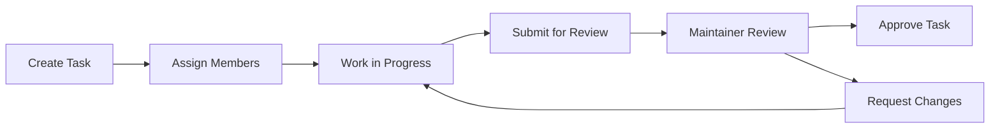

## Overview

Tasks are the core work units in TeamUp. Each task can have multiple assignees, file attachments, and goes through a submission and approval workflow. Maintainers review and approve completed tasks to ensure quality control.

## Task Schema

### Database Structure

Tasks are stored with the following schema:

```typescript taskModel.ts
const taskSchema = new mongoose.Schema({
  description: { 
    type: String, 
    required: true 
  },
  assignees: [{ 
    type: String 
  }],
  fileUrl: { 
    type: String 
  },
  projectName: { 
    type: String, 
    required: true 
  },
  projectId: { 
    type: mongoose.Schema.Types.ObjectId, 
    required: true 
  },
  createdAt: { 
    type: Date, 
    default: Date.now 
  },
  submitted: { 
    type: Boolean, 
    default: false 
  },
  approvals: [{ 
    type: String 
  }], // Array of maintainer emails who approved
});
```

### Key Fields

- **description**: Task details and requirements (required)
- **assignees**: Array of email addresses for assigned team members
- **fileUrl**: Path to attached file (optional)
- **projectName**: Name of parent project (required)
- **projectId**: Reference to parent project (required)
- **submitted**: Submission status flag
- **approvals**: Array of maintainer emails who have approved the task

<Note>
Tasks are linked to projects via `projectId` and maintain a reference to the project name for quick lookups.
</Note>

## Creating Tasks

### Task Creation with File Upload

Create a new task with optional file attachment:

```typescript task/route.ts
export async function POST(request: NextRequest) {
  try {
    const { fields, fileUrl } = await parseForm(request, uploadDir);

    // Extract task details
    const description = Array.isArray(fields.description)
      ? fields.description[0]
      : fields.description || '';

    // Parse assignee emails from form data
    const assigneeEmails = fields.assignees
      ? JSON.parse(
          Array.isArray(fields.assignees) 
            ? fields.assignees[0] 
            : fields.assignees
        )
      : [];

    const projectName = Array.isArray(fields.projectName)
      ? fields.projectName[0]
      : fields.projectName || '';

    const projectId = Array.isArray(fields.projectId)
      ? fields.projectId[0]
      : fields.projectId || '';

    // Validate required fields
    if (!description || !projectName || !projectId) {
      return NextResponse.json(
        { success: false, message: 'Missing required fields' },
        { status: 400 }
      );
    }

    // Create task with updated schema fields
    const task = await Task.create({
      description,
      assignees: assigneeEmails,
      fileUrl,
      projectName,
      projectId,
      createdAt: new Date(),
      submitted: false,
      approvals: [],
    });

    // Update each assignee's user document
    for (const email of assigneeEmails) {
      await User.findOneAndUpdate(
        { emailId: email },
        { $push: { tasks: task._id } }
      );
    }

    // Update project document
    await Project.findByIdAndUpdate(
      projectId,
      { $push: { tasks: task._id } }
    );

    return NextResponse.json({
      success: true,
      message: 'Task created successfully',
      task: {
        id: task._id,
        description,
        assignees: assigneeEmails,
        fileUrl,
        projectName,
        projectId,
        createdAt: task.createdAt,
        submitted: task.submitted,
        approvals: task.approvals
      },
    });
  } catch (error) {
    console.error('Error creating task:', error);
    return NextResponse.json(
      { success: false, message: 'Error creating task' },
      { status: 500 }
    );
  }
}
```

### Creation Process

When a task is created:

1. Task details are extracted from form data
2. File is uploaded (if provided)
3. Task document is created in database
4. Task ID is added to each assignee's user document
5. Task ID is added to project's task array

<Info>
Task creation automatically updates both user and project documents to maintain bidirectional references.
</Info>

## Assigning Team Members

### Multiple Assignees

Tasks can be assigned to multiple team members:

```typescript
const taskData = {
  description: "Implement user authentication",
  assignees: [
    "alice@example.com",
    "bob@example.com"
  ],
  projectId: "project123",
  projectName: "Auth System"
};
```

### Assignee Management

When assignees are added:

```typescript
for (const email of assigneeEmails) {
  await User.findOneAndUpdate(
    { emailId: email },
    { $push: { tasks: task._id } }
  );
}
```

<Warning>
Ensure all assignees are members of the project (in the contributors list) before assigning tasks to them.
</Warning>

## File Attachments

### File Upload Configuration

Tasks support file attachments with the following configuration:

```typescript task/route.ts
const uploadDir = join(process.cwd(), 'public', 'uploads');

const form = formidable({
  uploadDir,
  keepExtensions: true,
  maxFileSize: 10 * 1024 * 1024, // 10MB limit
  filename: (name, ext, path, form) => {
    return `${Date.now()}-${path}`;
  }
});
```

### File Processing

The file upload process:

```typescript
async function parseForm(
  req: NextRequest, 
  uploadDir: string
): Promise<{ fields: Fields; fileUrl: string | null }> {
  return new Promise(async (resolve, reject) => {
    const form = formidable({
      uploadDir,
      keepExtensions: true,
      maxFileSize: 10 * 1024 * 1024,
      filename: (name, ext, path, form) => {
        return `${Date.now()}-${path}`;
      }
    });

    // Convert Next.js request to Node.js IncomingMessage
    const chunks = [];
    const reader = req.body?.getReader();
    
    while (true) {
      const { done, value } = await reader.read();
      if (done) break;
      chunks.push(value);
    }

    const buffer = Buffer.concat(chunks);
    const stream = Object.assign(new Readable(), {
      // IncomingMessage properties...
    }) as unknown as IncomingMessage;

    stream.push(buffer);
    stream.push(null);

    form.parse(stream, (err, fields, files) => {
      if (err) {
        reject(err);
        return;
      }

      const file = Array.isArray(files.file) 
        ? files.file[0] 
        : files.file;
      const fileUrl = file && file.newFilename
        ? `/uploads/${file.newFilename}`
        : null;

      resolve({ fields, fileUrl });
    });
  });
}
```

### File Storage

- **Location**: `public/uploads/` directory
- **Max size**: 10MB per file
- **Naming**: Timestamped filenames to prevent collisions
- **Access**: Files accessible via `/uploads/filename` URL

<Tip>
Files are stored with timestamp prefixes to ensure unique filenames and prevent overwrites.
</Tip>

## Task Submission Workflow

### Submitting Tasks

When a contributor completes a task, they submit it for review:

```typescript task/submit/route.ts
export async function POST(request: NextRequest) {
  try {
    const { taskId, userEmail } = await request.json();
    const task = await Task.findById(taskId);
    
    if (!task) {
      return NextResponse.json(
        createApiResponse(false, null, 'Task not found', 404)
      );
    }

    task.submitted = true;
    await task.save();

    return NextResponse.json(
      createApiResponse(true, { task }, 'Task submitted successfully')
    );
  } catch (error) {
    return NextResponse.json(
      createApiResponse(false, null, 'Error submitting task', 500)
    );
  }
}
```

### Submission States

- **Not submitted** (`submitted: false`): Task in progress
- **Submitted** (`submitted: true`): Task awaiting approval
- **Approved**: Task has received maintainer approvals

<Note>
Submitting a task makes it visible to maintainers for review and approval.
</Note>

## Approval Tracking

### Maintainer Approvals

Maintainers can approve submitted tasks:

```typescript task/approve/route.ts
export async function POST(request: NextRequest) {
  try {
    await connectDB();
    
    const { taskId, maintainerEmail } = await request.json();
    const task = await Task.findById(taskId);
    
    if (!task) {
      return NextResponse.json(
        createApiResponse(false, null, 'Task not found', 404)
      );
    }
    
    // Add maintainer to approvals if not already present
    if (!task.approvals.includes(maintainerEmail)) {
      task.approvals.push(maintainerEmail);
      await task.save();
    }
    
    return NextResponse.json(
      createApiResponse(true, task, 'Task approved successfully')
    );
  } catch (error) {
    const errorResponse = handleApiError(error);
    return NextResponse.json(
      createApiResponse(
        false, 
        null, 
        errorResponse.message, 
        errorResponse.status
      ),
      { status: errorResponse.status }
    );
  }
}
```

### Approval Rules

- Only **maintainers** can approve tasks
- Each maintainer can approve once
- Multiple maintainers can approve the same task
- Approvals are tracked by maintainer email

<Info>
The `approvals` array stores email addresses of all maintainers who have approved the task, enabling tracking of who reviewed the work.
</Info>

## Fetching Tasks

### Get Single Task

Retrieve a specific task:

```typescript
const response = await fetch(`/api/task?id=${taskId}`);
const { task } = await response.json();
```

### Get Project Tasks

Retrieve all tasks for a project:

```typescript
const response = await fetch(`/api/task?projectId=${projectId}`);
const { tasks } = await response.json();
```

The API endpoint:

```typescript task/route.ts
export async function GET(request: NextRequest) {
  try {
    const taskId = request.nextUrl.searchParams.get('id');
    const projectId = request.nextUrl.searchParams.get('projectId');

    if (projectId) {
      const project = await Project.findById(projectId);
      if (!project) {
        return NextResponse.json(
          { success: false, message: 'Project not found' },
          { status: 404 }
        );
      }

      // Fetch all tasks for the project
      const tasks = await Task.find({ projectId: projectId });

      return NextResponse.json({
        success: true,
        tasks: tasks.map(task => ({
          id: task._id,
          description: task.description,
          assignees: task.assignees,
          fileUrl: task.fileUrl,
          projectName: task.projectName,
          projectId: task.projectId,
          createdAt: task.createdAt,
          submitted: task.submitted,
          approvals: task.approvals
        }))
      });
    }

    // Single task fetch logic...
  } catch (error) {
    console.error('Error fetching task:', error);
    return NextResponse.json(
      { success: false, message: 'Error fetching task' },
      { status: 500 }
    );
  }
}
```

<Tip>
Use the `projectId` parameter to fetch all tasks for a project in a single request.
</Tip>

## Task Lifecycle

### Complete Workflow

1. **Creation**: Maintainer or owner creates task with assignees
2. **Assignment**: Assignees receive task in their task list
3. **Work**: Contributors work on the task and attach files
4. **Submission**: Assignees submit completed task
5. **Review**: Maintainers review submitted work
6. **Approval**: Maintainers approve task (multiple approvals possible)
7. **Completion**: Task marked as approved



## Best Practices

### Task Creation

1. **Clear descriptions**: Provide detailed requirements and acceptance criteria
2. **Appropriate assignees**: Assign team members with relevant skills
3. **File attachments**: Include reference materials or specifications
4. **Break down work**: Create smaller, manageable tasks

### Task Management

```typescript
// Example: Creating a well-structured task
const taskData = {
  description: `
# User Authentication Feature

## Requirements
- Implement login/logout functionality
- Add password reset flow
- Write unit tests

## Acceptance Criteria
- All tests pass
- Code review approved
- Documentation updated
  `,
  assignees: ["developer@example.com"],
  projectId: "123",
  projectName: "Auth System"
};
```

### Error Handling

```typescript
try {
  const task = await Task.findById(taskId);
  if (!task) {
    throw new Error('Task not found');
  }
  if (!task.submitted) {
    throw new Error('Task must be submitted before approval');
  }
  // Proceed with approval
} catch (error) {
  console.error('Error processing task:', error);
  return { error: error.message };
}
```

<Warning>
Always validate task state before performing operations. Check that tasks exist, are submitted before approving, and that users have proper permissions.
</Warning>