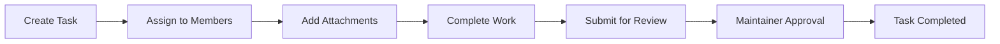

Tasks are the fundamental units of work in TeamUp. This guide covers the complete task lifecycle, from creation through approval, helping your team maintain consistent workflows and quality standards.

## Task Lifecycle Overview

Every task in TeamUp follows this workflow:



## Creating Tasks

Any project member (contributor, maintainer, or owner) can create tasks.

<Steps>
  <Step title="Navigate to Your Project">
    Open the project where you want to create a task from your dashboard.
  </Step>

  <Step title="Open Task Creation">
    Click **+ New Task** or **Create Task** to open the task creation form.
  </Step>

  <Step title="Write Task Description">
    Provide a clear description of what needs to be done. Be specific about:
    - What work is required
    - Expected outcomes
    - Any constraints or requirements
    - Links to relevant resources

    <Tip>
      Write task descriptions as if you're explaining the work to someone unfamiliar with the context. Include enough detail that assignees can start working without additional questions.
    </Tip>

    **Example Good Description:**
    ```markdown
    Implement user authentication for the mobile app.

    Requirements:
    - Email/password login
    - OAuth integration (Google, Apple)
    - Password reset functionality
    - Session management with JWT tokens

    Technical specs: https://docs.example.com/auth-spec
    Design mockups: https://figma.com/project/auth-screens
    ```

    **Example Poor Description:**
    ```text
    Do the login thing
    ```
  </Step>

  <Step title="Select Project Context">
    Confirm the correct project is selected. The task will be created in this project and visible to all project members.

    <Info>
      The project name and ID are automatically associated with the task. This ensures tasks are organized correctly and helps with project statistics.
    </Info>
  </Step>

  <Step title="Create the Task">
    Click **Create Task** to save. The task is now created with:
    - Status: Not submitted
    - Approvals: None
    - Created timestamp
    - Associated project
  </Step>
</Steps>

### Task Creation Best Practices

<CardGroup cols={2}>
  <Card title="Be Specific" icon="bullseye">
    Clear, detailed descriptions reduce back-and-forth questions and help assignees understand expectations.
  </Card>
  <Card title="Right-Size Tasks" icon="ruler">
    Break large features into smaller, manageable tasks that can be completed in a reasonable timeframe.
  </Card>
  <Card title="Include Context" icon="link">
    Link to design files, documentation, or related resources to give assignees everything they need.
  </Card>
  <Card title="Define Success" icon="check">
    Clearly state what "done" looks like so reviewers know what to approve.
  </Card>
</CardGroup>

## Assigning Tasks

Once a task is created, it needs to be assigned to team members who will complete the work.

<Steps>
  <Step title="Open Task Details">
    Click on the task to open its detail view.
  </Step>

  <Step title="Select Assignees">
    Choose one or more team members to assign the task to:

    ### Single Assignee
    Assign to one person for:
    - Individual work items
    - Clear ownership
    - Simple tasks

    ### Multiple Assignees
    Assign to multiple people for:
    - Collaborative work
    - Cross-functional tasks (design + development)
    - Pair programming
    - Knowledge sharing

    <Note>
      All assignees receive notifications and can upload attachments. The task appears in each assignee's task list.
    </Note>
  </Step>

  <Step title="Save Assignment">
    Click **Assign** to save. The task is immediately added to each assignee's task list, and they receive a notification.
  </Step>
</Steps>

### Assignment Considerations

<Warning>
  **Important:** If a task has only one assignee and that person is removed from the project, the task will be permanently deleted. For critical tasks, consider assigning multiple people or reassigning before removing team members.
</Warning>

## Working with File Attachments

Tasks support file uploads for deliverables, documentation, screenshots, or any work artifacts.

### Uploading Files

<Steps>
  <Step title="Open Task">
    Navigate to the task where you want to upload a file.
  </Step>

  <Step title="Select File">
    Click **Upload File** or drag and drop a file into the upload area.

    **Supported:**
    - Maximum file size: 10 MB
    - Keeps original file extension
    - Most file types supported (images, documents, code files, etc.)
  </Step>

  <Step title="Upload Completes">
    The file is stored and a link is added to the task. All project members can access the uploaded file.
  </Step>
</Steps>

### File Management

- **Naming:** Files are automatically renamed with a timestamp to prevent conflicts
- **Storage:** Files are stored in `/uploads/` with unique identifiers
- **Access:** All project members can view and download task attachments
- **Limits:** One file per upload; upload multiple times for multiple files

<Tip>
  For multiple related files, consider creating a ZIP archive or using a shared folder link in the task description.
</Tip>

## Submitting Tasks for Review

When work is complete, assignees submit tasks for maintainer review and approval.

### Submission Process

<Steps>
  <Step title="Complete Your Work">
    Before submitting, ensure:
    - All work described in the task is finished
    - Relevant files are uploaded
    - Work meets project quality standards
    - You've tested/reviewed your own work
  </Step>

  <Step title="Submit for Review">
    Click **Submit for Review** in the task details.

    This action:
    - Changes task status to `submitted: true`
    - Notifies project maintainers
    - Adds the task to the review queue
    - Locks further modifications by contributors

    <Info>
      Once submitted, the task is in the maintainer review queue. You cannot unsubmit a task yourself - a maintainer must take action.
    </Info>
  </Step>

  <Step title="Wait for Review">
    Maintainers will review your work and either:
    - **Approve** the task
    - **Request changes** (via comments or by resetting submission)
  </Step>
</Steps>

### Before Submitting Checklist

<Checklist>
  - [ ] All requirements in task description are met
  - [ ] Work has been tested and verified
  - [ ] Files uploaded if needed (code, designs, documentation)
  - [ ] No known issues or incomplete work
  - [ ] Ready for maintainer review
</Checklist>

## Task Approval Process

Maintainers and owners review submitted tasks and approve them when work meets standards.

### How Approval Works

<Steps>
  <Step title="Maintainer Reviews Task">
    Maintainers see submitted tasks in the review queue and can:
    - View task description and requirements
    - Download and review uploaded files
    - Check work against project standards
  </Step>

  <Step title="Approve the Task">
    If work is satisfactory, the maintainer clicks **Approve Task**.

    This action:
    - Adds the maintainer's email to the task's `approvals` array
    - Creates an approval record with timestamp
    - Updates project statistics
    - Notifies task assignees

    ```javascript
    // Approval data structure
    {
      taskId: "507f1f77bcf86cd799439011",
      maintainerEmail: "lead@company.com",
      approvals: ["lead@company.com"],
      submitted: true
    }
    ```
  </Step>

  <Step title="Track Approval Progress">
    Tasks can receive multiple approvals:
    - Each maintainer can approve independently
    - Duplicate approvals are prevented (same maintainer can't approve twice)
    - All approvals are tracked in the `approvals` array
    - View approval history in task details
  </Step>
</Steps>

### Approval Permissions

<AccordionGroup>
  <Accordion title="Who Can Approve Tasks?" icon="check">
    Only **maintainers** and **owners** can approve tasks. Contributors cannot approve tasks, even their own.

    - Project Owner: ✓ Can approve
    - Maintainers: ✓ Can approve  
    - Contributors: ✗ Cannot approve
  </Accordion>

  <Accordion title="Multiple Approvals" icon="users">
    Multiple maintainers can approve the same task:
    - Useful for tasks requiring multi-stakeholder sign-off
    - Each approval is recorded with maintainer email
    - System prevents duplicate approvals from same person
    - No maximum approval limit
  </Accordion>

  <Accordion title="Approval Requirements" icon="shield-check">
    Projects don't enforce a minimum number of approvals - this is up to your team's processes:
    - One approval may be sufficient for simple tasks
    - Critical tasks may require multiple maintainer approvals
    - Define approval requirements in your project description
  </Accordion>
</AccordionGroup>

### What Happens After Approval

Once a task is approved:

- ✓ Task status remains `submitted: true`
- ✓ Approvals are permanently recorded
- ✓ Project statistics update (completed tasks count)
- ✓ Task assignees are notified
- ✓ Task appears in project completion metrics

<Note>
  Approved tasks remain in the project for historical tracking and statistics. They cannot be unmarked as approved, ensuring approval integrity.
</Note>

## Tracking Task Progress

### Task States

Tasks exist in one of these states:

| State | Description | Actions Available |
|-------|-------------|-------------------|
| **Created** | Task exists but not submitted | Edit, assign, upload files, submit |
| **Submitted** | Awaiting maintainer review | Approve (maintainers only) |
| **Approved** | At least one maintainer approval | View only, track in statistics |

### View Your Tasks

As a team member, you can:

- **View all your assigned tasks** in your personal task list
- **Filter by project** to see project-specific tasks
- **Check submission status** to see what's pending review
- **View approvals** to see which maintainers approved your work

### Project-Wide Task View

Project members can view all project tasks:

```text
GET /api/task?projectId={projectId}
```

This returns:
- All tasks in the project
- Task descriptions and assignees
- Submission status for each task
- Approval records
- File attachments
- Creation timestamps

## Advanced Workflows

### Collaborative Tasks

When multiple people work on one task:

1. **Assign all collaborators** to the task
2. **Coordinate work** using task comments or external tools
3. **Upload files** as each person completes their part
4. **Designate one person** to submit when all work is done
5. **Maintainer reviews** the complete collaborative work

### Task Dependencies

TeamUp doesn't have built-in task dependencies, but you can manage them:

- **In task descriptions:** Note prerequisite tasks
- **Sequencing:** Wait to create dependent tasks until prerequisites are approved
- **Communication:** Use project description to document workflows

### Quality Gates

Implement quality checks before submission:

<Checklist>
  - [ ] Code reviewed by peer (for development tasks)
  - [ ] Tests written and passing
  - [ ] Documentation updated
  - [ ] Design specifications met
  - [ ] No critical issues or bugs
</Checklist>

## Common Scenarios

<AccordionGroup>
  <Accordion title="Task needs changes after submission">
    The maintainer should communicate needed changes to assignees. TeamUp doesn't have a formal "request changes" feature, so use:
    - Project chat/communication tools
    - Task comments (if implemented)
    - Direct communication

    The maintainer can wait to approve until changes are made.
  </Accordion>

  <Accordion title="Wrong person assigned to task">
    If the task hasn't been submitted:
    1. Note the task details
    2. Remove incorrect assignee from project (deletes task if solo assignee)
    3. Create new task with correct assignee

    If you need to preserve the task, add the correct assignee before removing the wrong one.
  </Accordion>

  <Accordion title="Task submitted by mistake">
    Contact a maintainer to handle the situation. Only maintainers can manage submitted tasks. There's no self-service "unsubmit" feature.
  </Accordion>

  <Accordion title="Need approval from specific maintainer">
    Communicate outside the platform which maintainer should review. Any maintainer can approve any task - selection is by team agreement, not system enforcement.
  </Accordion>
</AccordionGroup>

## Best Practices Summary

### For Task Creators
- Write clear, detailed descriptions
- Include success criteria
- Link to relevant resources
- Right-size task scope

### For Task Assignees  
- Confirm you understand requirements before starting
- Upload work-in-progress files for transparency
- Complete all requirements before submitting
- Self-review before submission

### For Maintainers
- Review tasks promptly to avoid bottlenecks
- Provide clear feedback when requesting changes
- Approve when work meets standards
- Document approval criteria in project description

### For Everyone
- Use consistent workflows across the team
- Communicate status proactively
- Keep file uploads organized and labeled
- Track task progress regularly

## Troubleshooting

<AccordionGroup>
  <Accordion title="Can't submit task for review">
    Possible causes:
    - You're not assigned to the task
    - Task is already submitted
    - Connection issues

    Try refreshing the page and verifying you're an assignee.
  </Accordion>

  <Accordion title="File upload failing">
    Check:
    - File size under 10 MB
    - Stable internet connection
    - File isn't corrupted

    Try a smaller file or different format.
  </Accordion>

  <Accordion title="Task disappeared from my list">
    Possible reasons:
    - You were unassigned from the task
    - You were removed from the project
    - Task was deleted (if you were sole assignee and removed)

    Check with project owner or maintainers.
  </Accordion>

  <Accordion title="Can't see approval status">
    Refresh the task details page. Approvals should appear immediately after a maintainer approves. If still missing, check:
    - Your connection
    - Whether you're viewing the correct task
    - Browser cache (try incognito mode)
  </Accordion>
</AccordionGroup>

## Next Steps

<CardGroup cols={2}>
  <Card title="Project Dashboards" icon="chart-line" href="/guides/project-dashboards">
    Monitor task progress and project statistics
  </Card>
  <Card title="Managing Teams" icon="users-gear" href="/guides/managing-teams">
    Learn about team member roles and permissions
  </Card>
</CardGroup>